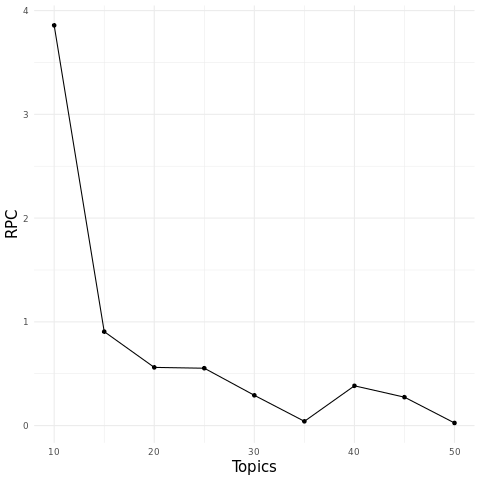
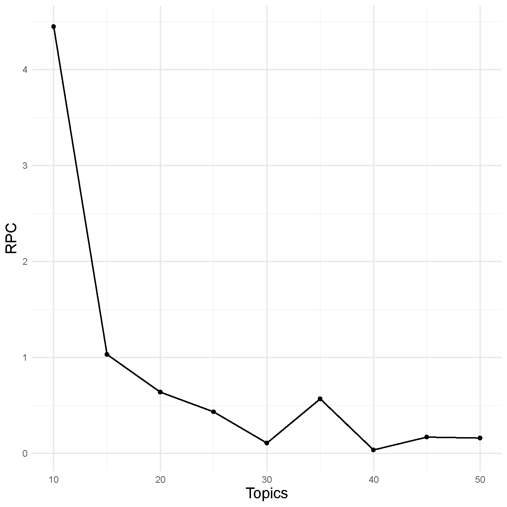

```{r, include = FALSE}
knitr::opts_chunk$set(
  collapse = TRUE,
  comment = "#>"
)
```

```{r message = F, warning=F}
library(TITAN)
library(Seurat)
```

In its current state, TITAN is built to work off of the R package `Seurat`. The first step in any TITAN workflow is to create a Seurat object containing the data you would like to run an LDA model on. This tutorial assumes that general QC has been run and poorly performing cells have been filtered out. Once you've done this, you can begin using TITAN. To begin building the model, the user has two options. 

### Building a Model

The first is running a single LDA model on the data.

```{r eval = F}
LDA_model <- runLDA(SeuratObj, ntopics = 50)

```

This will return an LDA model with 50 topics, created using the default alpha and beta values, as well as the default values for a number of other parameters. Depending on the size of your data, this function can take multiple hours to run, so it is important to make sure you have the necessary computational resources. 


The second option is to use the `parallel_runLDA` function. This is for users that may not know how many topics they want in their model. This function does the same thing as the `runLDA` function, but a number of times in parallel, each time using a different number of topics. 

```{r eval = F}
parallel_runLDA(SeuratObj, "output_directory", top_start = 5, top_end = 50, step = 5)

```

The above command will run 10 instances of the `runLDA` function starting with only using 5 topics, going up to using 50 topics, stepping up by 5 each time. The 10 instances are run at the same time in parallel. The models will be output as `.rds` files into the given output directory. 

### Evaluating Models

Now the task is to determine which of these models is the ideal one to use in downstream analysis. To do this we have developed our own version of an Elbow plot.

```{r eval = F}
LDAelbowPlot("output_directory", SeuratObj)

```

{ width=40% }

### Analyzing Models

Now that we have built a model and determine that it does a good job of capturing our data, we can analyze the model. For the rest of the vignette, we will be using a model with 20 topics that was built on a dataset containing T47D single cells, some treated with estrogen, some treated with progesterone, and some treated with both estrogen and progesterone.

First, read in the Seurat object RDS and the model RDS.

```{r}
SO <- readRDS("../data/PEPE_T47D.rds")
top_model <- readRDS("../data/Model_PEPE_T47D_20T_CLR_5000Variable_M10.rds")

```

The first step in the analysis pipeline is to add the topic information to the original Seurat object. This allows us to employ many of Seurat's built in plot functions to visualize the model.

```{r}
SO <- addTopicsToSeuratObject(top_model, SO)

```

Now that the topic information has been stored within the Seurat object, we can begin analyzing the contents of the topics.

```{r}
LDA_topics <- GetTopics(top_model, SO)
```

The above chunk of code extracts the top 50 genes associated with each topic. These genes can be used to connect each topic to a certain gene network or ontology. 

Next, the goal is to see which cells express which topics. We do this through heatmaps.

```{r, fig.width=8, fig.height=8}
heatmap(Object = SO,
          topics =  LDA_topics,
          AnnoVector = SO@meta.data$hash.ID,
          AnnoName = "Time Point")


```

You can also cluster the topics of the heatmap so that topics with similar expression patterns across cells are grouped together.

```{r, fig.width=8, fig.height=8}
heatmapClusterTopics(Object = SO,
          topics =  LDA_topics,
          AnnoVector = SO@meta.data$hash.ID,
          AnnoName = "Time Point")

```

In both of the above cases, the rows of the heatmap were sorted by time point. They can be sorted by any metadata column in the Seurat object as well, such as cluster.

```{r, fig.width=8, fig.height=8}
heatmap(Object = SO,
          topics =   LDA_topics, 
          AnnoVector = SO$seurat_clusters, 
          AnnoName = "Cluster")


```


Another way to visualize the expression of the topics is through Seurat's FeaturePlot function.

```{r, fig.width=8, fig.height=6}
FeaturePlot(SO, pt.size = 0.01, features  = paste("Topic", 13:20, sep = "_"), ncol = 4, min.cutoff = 'q5')

```

This plots the cells using the UMAP embeddings within the Seurat object, and then colors the cells based on their expression of the given topic.

### Using a SingleCellExperiment Object

Building the model is ran the same way,

```{r}
SCE <- readRDS("../data/PEPE_T47D_SCE.rds")
```

Running a single model,

```{r eval = F}
LDA_model <- runLDA(SCE, ntopics = 50)

```

Running multiple models,

```{r eval = F}
parallel_runLDA(SCE, "output_directory", top_start = 5, top_end = 50, step = 5)

```

Checking the number of topics through an Elbow plot

```{r eval = F}
LDAelbowPlot("output_directory", SCE)

```

{ width=40% }

Loading in the pre-built model using the same number of topics as before,

```{r}
SCE_model <- readRDS("../data/Model_SCE_PEPE_T47D_20T.rds")
```

This model will be slightly different than the one ran using the Seurat object. This is due to the SingleCellExperiment workflow using a slightly different feature space. However, the results remain mostly the same.

```{r}
SCE <- addTopicsToSCE(SCE_model, SCE)

```


```{r, fig.width=8, fig.height=8}
SCE_topics <- GetTopics(SCE_model, SCE)
heatmap(SCE, SCE_topics, SCE@colData@listData$hash.ID, "Timepoint")

```

```{r, warning=F, fig.width=8, fig.height=6}
SCE_FeaturePlot(SCE, pt.size = 0.01, topics = 1:8, ncol = 4, min.cutoff = 'q5')
SCE_FeaturePlot(SCE, pt.size = 0.01, topics = 9:16, ncol = 4, min.cutoff = 'q5')
```

```{r echo = F, warning=F, fig.width=8, fig.height=3}
SCE_FeaturePlot(SCE, pt.size = 0.01, topics = 17:20, ncol = 4, min.cutoff = 'q5')

```


