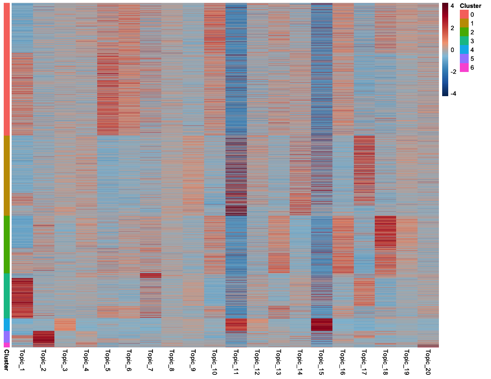
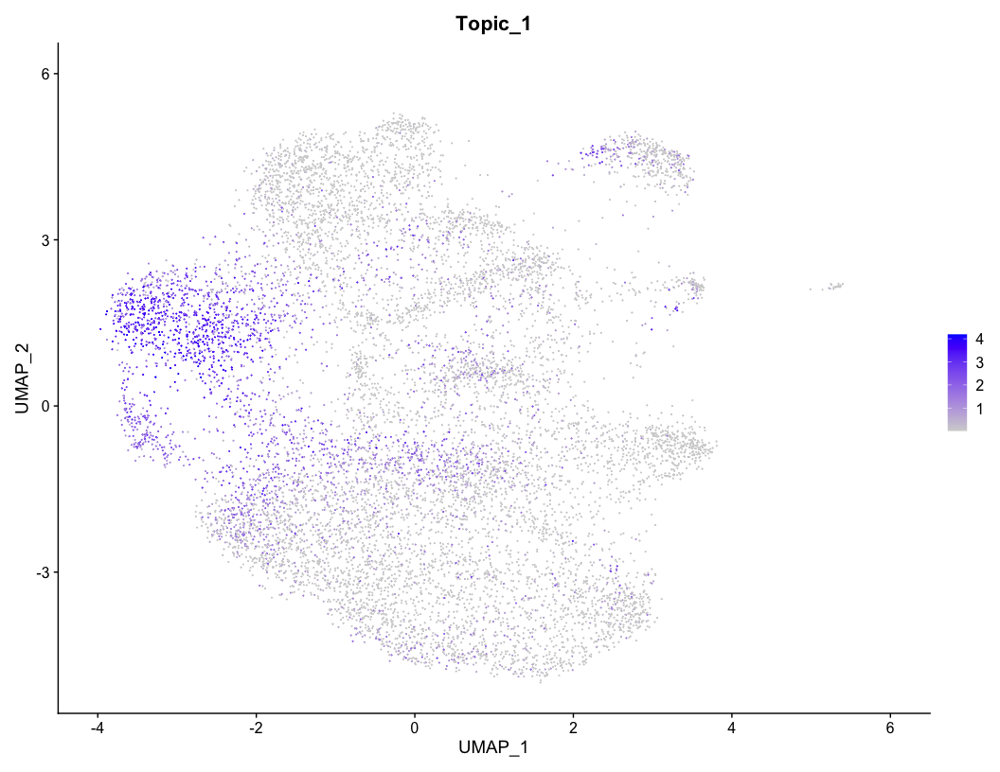

TITAN Tutorial
================

## What is Titan?

TITAN (Topic Inference of Transciptionally Associated Networks) is an R
package that runs Topic Modeling on scRNA-seq data. Topic modeling in
the traditional sense has been used in text mining to link words and
documents to topics. Topics in the traditional sense can be thought of
as themes, such as categories in news article inference (science,
politics, etc). TITAN applies topic modeling to scRNA-seq to find latent
transcriptional topics that link genes to topics and cells to topics.
TITAN utalizes a nlp alghorithm called Latent Dirchlet Allocation (LDA)
that maximizes these two probability distributions that show 1) the
probability a gene is assigned to a topic and 2) the probability a cell
is assigned to a topic.

## Object Setup

``` r
library(TITAN)
library(Seurat)
library(tidyverse)
library(knitr)
```

In its current state, TITAN is built to work off of the R package
`Seurat`. The first step in TITAN is to create a Seurat object
containing your scRNA-seq data. This tutorial assumes that general QC
has been run and poorly performing cells have been filtered out.
Directions for that can be found in the vingette found
[here](https://satijalab.org/seurat/v3.1/pbmc3k_tutorial.html). We also
understand that there are other formats of single cell objects, such as
SingleCellExpiriment. Seurat has documentation on conversion to
SeuratObject from different types of objects found
[here](https://satijalab.org/seurat/v3.1/conversion_vignette.html). Once
you’ve done this, you can begin using TITAN. To begin building the
model, the user has two options.

## Building a Model

The first is running a single LDA model on the data. This process has
two steps. First is to normalize the data. We do this using Seurats
normalize data function with the added recommendation that one uses the
centered log-ratio (CLR) transformation due to the varying levels of
gene expression seen per cell and topic modeling’s preference for genes
that have high counts.

### Single topic

``` r
# SeuratObj <- readRDS("../data/PEPE_T47D.rds")
LDA_model <- runLDA(SeuratObj, ntopics = 50, normalizationMethod = "CLR")
```

This will return an LDA model with 50 topics, created using the default
alpha and beta values, as well as the default values for a number of
other parameters. More info about these parameters can be found at
`?runLDA`.min Depending on the size of your data, this function can take
multiple hours to run, so it is important to make sure you have the
necessary computational resources.

### Multiple Topics

The second option is to use the parallel option of the `runLDA`
function. This is for users that may not know how many topics they want
in their model. This function does the same thing as above, but a number
of times in parallel, each time using a different number of topics. Now
the `ntopics` argument takes a vector of numbers and the function will
produce a new model for every number of topics in the
list.

``` r
runLDA(SeuratObj, ntopics = seq(5, 50, by=5), parallel = TRUE, outDir = "output_directory", cores = 10)
```

The above command will run 10 instances of the `runLDA` function
starting with only using 5 topics, going up to using 50 topics, stepping
up by 5 each time. The 10 instances are run at the same time in
parallel. The models will be output as `.rds` files into the given
output directory.

## Evaluating Models

### Elbow Plot nTopics

Now the task is to determine which of these models is the ideal one to
use in downstream analysis. To do this we have developed our own version
of an Elbow plot. This elbow plot looks at the perplexity of each model,
a measure how well the model fits the data while also giving models that
use less parameters a higher score. The Y axis of the plot is the RPC
(rate of perplexity change), which looks at how much the perplexity
changes as the topic number increases. This method is based off
[this](https://bmcbioinformatics.biomedcentral.com/articles/10.1186/1471-2105-16-S13-S8)
paper by Zhao et al.

``` r
LDAelbowPlot("output_directory", SeuratObj)
```


## Analyzing Models

Now that we have built a model and determine that it does a good job of
capturing our data, we can analyze the model. For the rest of the
vignette, we will be using a model with 20 topics that was built on a
dataset containing T47D single cells, some treated with estrogen, some
treated with progesterone, and some treated with both estrogen and
progesterone.

### Load Data

First, read in the model
RDS.

``` r
# top_model <- readRDS("../data/Model_PEPE_T47D_20T_CLR_5000Variable_M10.rds")
top_model <- readRDS("~/Box Sync/Alex_Data/MCF7/PEPE/Model_PEPE_T47D_20T_CLR_5000Variable_M10.rds")
SeuratObj<- readRDS("~/Box Sync/Alex_Data/MCF7/PEPE/RDS/PEPE_T47D.rds")
```

The first step in the analysis pipeline is to add the topic information
to the original Seurat object. This allows us to employ many of Seurat’s
built in plot functions to visualize the
model.

``` r
SeuratObj <- addTopicsToSeuratObject(model = top_model, Object = SeuratObj)
```

### Gene-Topic Distribution

Now that the topic information has been stored within the Seurat object,
we can begin analyzing the contents of the topics. There are two
distrubutions that LDA outputs. The first being the assignments of genes
in each topic, using the scores of each gene per topic we can look at
which genes contribute most per topic. The first function here,
`GeneScores` outputs a matrix with a table of the scores for each gene.
Sorting by topic, one can see the disribution of genes and which genes
contribute most to each topic. Below is an example of showing only the
top topic 1 genes and subsequent scores of said for the first 10 topics.

``` r
GeneDistrubition <- GeneScores(top_model)

### head and sort the matrix by genes most contributing to Topic 1
kable(head(GeneDistrubition[order(GeneDistrubition[,"Topic_1"], decreasing = T),],n = 10))
```

|        |  Topic\_1 |  Topic\_2 |  Topic\_3 |  Topic\_4 |  Topic\_5 |    Topic\_6 |  Topic\_7 | Topic\_8 | Topic\_9 | Topic\_10 | Topic\_11 | Topic\_12 | Topic\_13 | Topic\_14 | Topic\_15 | Topic\_16 | Topic\_17 | Topic\_18 | Topic\_19 | Topic\_20 |
| :----- | --------: | --------: | --------: | --------: | --------: | ----------: | --------: | -------: | -------: | --------: | --------: | --------: | --------: | --------: | --------: | --------: | --------: | --------: | --------: | --------: |
| AZGP1  | 0.1346265 | 0.0000000 | 0.0000098 | 0.0000000 | 0.0000000 |   0.0000000 | 0.0000000 | 0.000000 | 0.000000 |         0 |         0 |         0 | 0.0000000 | 0.0000000 |         0 |         0 | 0.0000000 |         0 |   0.0e+00 | 0.0000000 |
| FKBP5  | 0.1322075 | 0.0000000 | 0.0000000 | 0.0000000 | 0.0000000 |   0.0000000 | 0.0000000 | 0.000000 | 0.000000 |         0 |         0 |         0 | 0.0000000 | 0.0000000 |         0 |         0 | 0.0000000 |         0 |   0.0e+00 | 0.0000000 |
| S100P  | 0.1110873 | 0.0000000 | 0.0000000 | 0.0000000 | 0.0000000 |   0.0000000 | 0.0000000 | 0.000000 | 0.000000 |         0 |         0 |         0 | 0.0000000 | 0.0000000 |         0 |         0 | 0.0000000 |         0 |   0.0e+00 | 0.0000000 |
| FXYD3  | 0.0819613 | 0.0000000 | 0.0000000 | 0.0000000 | 0.0000000 |   0.0000000 | 0.0291735 | 0.000000 | 0.000000 |         0 |         0 |         0 | 0.0000000 | 0.0000000 |         0 |         0 | 0.0000000 |         0 |   0.0e+00 | 0.0000000 |
| HILPDA | 0.0752538 | 0.0000000 | 0.0000000 | 0.0000000 | 0.0382517 |   0.0126441 | 0.0000000 | 0.000000 | 0.000000 |         0 |         0 |         0 | 0.0029028 | 0.0000000 |         0 |         0 | 0.0000000 |         0 |   0.0e+00 | 0.0000000 |
| AHNAK  | 0.0715123 | 0.0058055 | 0.0000000 | 0.0156755 | 0.0000000 |   0.0148088 | 0.0000000 | 0.000000 | 0.000000 |         0 |         0 |         0 | 0.0065821 | 0.0346001 |         0 |         0 | 0.0018055 |         0 |   0.0e+00 | 0.0030914 |
| GLUL   | 0.0695458 | 0.0000000 | 0.0050840 | 0.0000000 | 0.0000000 |   0.0000000 | 0.0146497 | 0.000000 | 0.000000 |         0 |         0 |         0 | 0.0061023 | 0.0022185 |         0 |         0 | 0.0000000 |         0 |   0.0e+00 | 0.0000000 |
| PIP    | 0.0620369 | 0.0000000 | 0.0000000 | 0.0000000 | 0.0979010 |   0.0000000 | 0.0000000 | 0.000000 | 0.000000 |         0 |         0 |         0 | 0.0000000 | 0.0000000 |         0 |         0 | 0.0000000 |         0 |   0.0e+00 | 0.0001377 |
| MRFAP1 | 0.0561239 | 0.0017033 | 0.0000000 | 0.0097168 | 0.0000000 |   0.0000000 | 0.0002105 | 0.000000 | 0.009754 |         0 |         0 |         0 | 0.0000000 | 0.0000000 |         0 |         0 | 0.0067015 |         0 |   0.0e+00 | 0.0080205 |
| FASN   | 0.0550610 | 0.0000000 | 0.0000000 | 0.0000000 | 0.0281004 | \-0.0000058 | 0.0000000 | 0.005891 | 0.000000 |         0 |         0 |         0 | 0.0000000 | 0.0171144 |         0 |         0 | 0.0000000 |         0 | \-4.9e-06 | 0.0000000 |

An alternative to this matrix is to get a matrix of the top n genes in
each topic. This can be done with `TopTopicScores`, which sorts the
gene-topic matrix and outputs a matrix list of n genes for eaech topic
which can be inputted into your favorite GO program.These genes can be
used to connect each topic to a certain gene network or ontology.

``` r
TopicGenes <- TopTopicGenes(top_model, ngenes = 50)
kable(head(TopicGenes[,1:10], 10))
```

| Topic\_1 | Topic\_2  | Topic\_3 | Topic\_4  | Topic\_5 | Topic\_6 | Topic\_7 | Topic\_8  | Topic\_9 | Topic\_10 |
| :------- | :-------- | :------- | :-------- | :------- | :------- | :------- | :-------- | :------- | :-------- |
| AZGP1    | DDIT3     | CDK5RAP2 | RRS1      | PIP      | SLC40A1  | S100A9   | IDI1      | TUBA1B   | ZFP36L2   |
| FKBP5    | SAT1      | PTMA     | KRT18     | ZG16B    | CYP1B1   | DEGS2    | HNRNPA3   | RAN      | FOS       |
| S100P    | JUND      | HLTF     | TP53I3    | FBXO32   | FOS      | CCL28    | HMGB1     | SNRPB    | ARL4D     |
| FXYD3    | ATF3      | PRKDC    | KRT8      | HES1     | HES1     | PLK2     | KTN1      | PLP2     | DST       |
| HILPDA   | SQSTM1    | FGD5-AS1 | CLDN3     | SELENOP  | SMARCA1  | KRT8     | HNRNPA2B1 | CBX3     | BTG1      |
| AHNAK    | TNFRSF12A | HMGN2    | ABCE1     | S100A9   | MT-ND4   | CRABP2   | RAC1      | PSMC3    | CYP1B1    |
| GLUL     | HMGCS1    | RANBP1   | CLDN7     | NUPR1    | MYCBP2   | S100A6   | HINT1     | TPI1     | SOD3      |
| PIP      | UBC       | PSMC3    | RPS2      | DBI      | TOB1     | KRT18    | SLC25A5   | HMGB1    | NEAT1     |
| MRFAP1   | MLF1      | PCM1     | RAB11FIP1 | IGFBP5   | BTG1     | CLU      | PPP1CC    | LSM4     | TXNRD1    |
| FASN     | DUSP14    | EBP      | FAM207A   | RARRES3  | DBI      | SNCG     | AP2B1     | HINT1    | PDE4DIP   |

``` r
kable(head(TopicGenes[,11:20], 10))
```

| Topic\_11 | Topic\_12 | Topic\_13 | Topic\_14 | Topic\_15 | Topic\_16 | Topic\_17 | Topic\_18 | Topic\_19 | Topic\_20 |
| :-------- | :-------- | :-------- | :-------- | :-------- | :-------- | :-------- | :-------- | :-------- | :-------- |
| CENPF     | PGP       | SAT1      | ARL6IP1   | HIST1H4C  | HSPB1     | SERPINA6  | TPM1      | IGFBP5    | TCTEX1D2  |
| NUSAP1    | CENPX     | CDC42EP3  | LGALS1    | GINS2     | FAM107B   | CTSD      | IER3      | CLU       | MGP       |
| PTTG1     | NOP56     | ID3       | GATA3-AS1 | HELLS     | TXNRD1    | STC2      | TMEM40    | TNFRSF12A | SPA17     |
| TOP2A     | SRSF7     | CYP1B1    | HMGN2     | ATAD2     | BTG1      | GNG11     | CSRP1     | GSTM3     | PPP1R2    |
| CCNB1     | GMPS      | MGP       | STMN1     | HIST1H1D  | SOX4      | B4GALT1   | CPE       | ACTG1     | IFT22     |
| CDKN3     | MCM4      | APOE      | HMGB1     | PCLAF     | CLDN4     | PGR       | BAG1      | CRIP1     | CCNO      |
| TPX2      | HNRNPAB   | NUPR1     | HINT1     | PCNA      | CEBPD     | TFF3      | CLU       | TMSB4X    | DNALI1    |
| CKS2      | DCTPP1    | CALD1     | SNHG9     | HIST1H1E  | S100A11   | FKBP4     | SLC7A5    | HSPA8     | MT-CYB    |
| UBE2S     | SLBP      | CPE       | HNRNPA2B1 | DUT       | CD24      | CA12      | TUBA4A    | GAPDH     | IGFBP5    |
| HMMR      | SRSF2     | CYB5A     | NUCKS1    | MCM3      | HSD17B1   | LY6E      | S100A6    | HSPB11    | CEP350    |

## Cell-Topic Distribution

The second distrubtion that TITAN outputs is the cell-topic distrubition
which outputs the contribution each cell belongs to a topic, calculated
from the gene scores. The `GetTopics` function outputs a scaled
cell-topic matrix. Alternatively, the `addTopicsToSeuratObject` function
added this cell-topic matrix to our metadata files so if that has been
run it can also be done by wrangling the meta.data in your Seurat
object.

``` r
## Using the get topics function
LDA_topics <- GetTopics(top_model, SeuratObj)
kable(head(LDA_topics[,1:10]))
```

|                     |    Topic\_1 |    Topic\_2 |    Topic\_3 |    Topic\_4 |    Topic\_5 |    Topic\_6 |    Topic\_7 |    Topic\_8 |    Topic\_9 |   Topic\_10 |
| :------------------ | ----------: | ----------: | ----------: | ----------: | ----------: | ----------: | ----------: | ----------: | ----------: | ----------: |
| AAACCCACACTGAATC\_1 |   0.2579056 | \-0.6875578 | \-0.4952836 |   0.2633352 |   0.1477421 |   1.7007007 | \-0.5366247 |   0.0503904 |   0.3196791 |   0.3008185 |
| AAACCCATCTTTGCAT\_1 | \-0.9389211 |   0.9302497 | \-0.6504646 |   0.0613059 | \-0.2794898 | \-0.1817111 | \-0.1005293 |   0.2740508 | \-0.0613992 | \-0.1633737 |
| AAACGAACAAATGGTA\_1 | \-0.4951609 |   0.8515864 | \-0.3061507 |   1.4062054 | \-1.1701668 | \-0.6974080 | \-0.1807059 | \-0.3113521 |   0.5413284 | \-1.2092316 |
| AAACGAAGTGTCATGT\_1 | \-0.9870433 | \-0.7481831 |   0.5260520 | \-0.1831654 | \-0.5311767 | \-0.1674966 | \-0.3774344 | \-0.3343159 |   0.6635954 | \-1.1992783 |
| AAACGCTAGATTACCC\_1 | \-0.6577751 |   0.2807817 | \-0.7965712 |   0.3820099 |   0.8697197 | \-0.5858447 |   2.1458108 |   0.9793462 | \-0.5689520 |   1.1895278 |
| AAACGCTAGGCGTTGA\_1 | \-0.4273528 | \-0.3371308 | \-0.6334652 |   1.5193007 | \-0.5124411 |   0.4952923 |   0.5350512 |   1.7340420 | \-0.9740367 |   0.7450958 |

``` r
kable(head(LDA_topics[,11:20]))
```

|                     |   Topic\_11 |   Topic\_12 |   Topic\_13 |   Topic\_14 |   Topic\_15 |   Topic\_16 |   Topic\_17 |   Topic\_18 |   Topic\_19 |   Topic\_20 |
| :------------------ | ----------: | ----------: | ----------: | ----------: | ----------: | ----------: | ----------: | ----------: | ----------: | ----------: |
| AAACCCACACTGAATC\_1 | \-2.1955556 | \-0.1900357 |   0.1345967 | \-0.4370345 | \-1.1569318 |   0.5217171 |   2.4942784 | \-1.1783644 |   0.6799374 |   0.0062869 |
| AAACCCATCTTTGCAT\_1 | \-1.1978202 | \-0.4949697 |   0.2690468 | \-0.2902747 | \-1.0645167 |   0.7554229 | \-0.4413251 |   3.5787286 |   0.1668858 | \-0.1708952 |
| AAACGAACAAATGGTA\_1 | \-1.0791592 |   0.9932455 | \-0.5323603 | \-0.3786841 | \-0.5540989 | \-0.7831065 |   2.5794752 |   0.1159567 |   1.4175410 | \-0.2077534 |
| AAACGAAGTGTCATGT\_1 | \-0.1076491 |   0.6172371 |   0.0466823 | \-0.5592155 |   0.5975039 | \-0.4263256 |   3.5049417 | \-0.8929718 | \-0.0589345 |   0.6171782 |
| AAACGCTAGATTACCC\_1 | \-1.2417767 | \-0.0744146 |   1.1255470 | \-1.1598774 | \-1.5927418 |   0.1226246 | \-1.0731378 |   0.3595397 | \-0.6487037 |   0.9448876 |
| AAACGCTAGGCGTTGA\_1 | \-1.3802540 | \-0.6446064 |   1.9130660 | \-0.7307870 | \-1.6223023 |   1.1186540 | \-0.3495828 | \-0.2228788 |   0.1040392 | \-0.3297034 |

``` r

## Using the meta data columns (must run addTopicsToSeruatObject() first)
LDA_topics <- SeuratObj@meta.data %>% select(starts_with("Topic"))
kable(head(LDA_topics[,1:10]))
```

|                     |    Topic\_1 |    Topic\_2 |    Topic\_3 |    Topic\_4 |    Topic\_5 |    Topic\_6 |    Topic\_7 |    Topic\_8 |    Topic\_9 |   Topic\_10 |
| :------------------ | ----------: | ----------: | ----------: | ----------: | ----------: | ----------: | ----------: | ----------: | ----------: | ----------: |
| AAACCCACACTGAATC\_1 |   0.2579056 | \-0.6875578 | \-0.4952836 |   0.2633352 |   0.1477421 |   1.7007007 | \-0.5366247 |   0.0503904 |   0.3196791 |   0.3008185 |
| AAACCCATCTTTGCAT\_1 | \-0.9389211 |   0.9302497 | \-0.6504646 |   0.0613059 | \-0.2794898 | \-0.1817111 | \-0.1005293 |   0.2740508 | \-0.0613992 | \-0.1633737 |
| AAACGAACAAATGGTA\_1 | \-0.4951609 |   0.8515864 | \-0.3061507 |   1.4062054 | \-1.1701668 | \-0.6974080 | \-0.1807059 | \-0.3113521 |   0.5413284 | \-1.2092316 |
| AAACGAAGTGTCATGT\_1 | \-0.9870433 | \-0.7481831 |   0.5260520 | \-0.1831654 | \-0.5311767 | \-0.1674966 | \-0.3774344 | \-0.3343159 |   0.6635954 | \-1.1992783 |
| AAACGCTAGATTACCC\_1 | \-0.6577751 |   0.2807817 | \-0.7965712 |   0.3820099 |   0.8697197 | \-0.5858447 |   2.1458108 |   0.9793462 | \-0.5689520 |   1.1895278 |
| AAACGCTAGGCGTTGA\_1 | \-0.4273528 | \-0.3371308 | \-0.6334652 |   1.5193007 | \-0.5124411 |   0.4952923 |   0.5350512 |   1.7340420 | \-0.9740367 |   0.7450958 |

``` r
kable(head(LDA_topics[,11:20]))
```

|                     |   Topic\_11 |   Topic\_12 |   Topic\_13 |   Topic\_14 |   Topic\_15 |   Topic\_16 |   Topic\_17 |   Topic\_18 |   Topic\_19 |   Topic\_20 |
| :------------------ | ----------: | ----------: | ----------: | ----------: | ----------: | ----------: | ----------: | ----------: | ----------: | ----------: |
| AAACCCACACTGAATC\_1 | \-2.1955556 | \-0.1900357 |   0.1345967 | \-0.4370345 | \-1.1569318 |   0.5217171 |   2.4942784 | \-1.1783644 |   0.6799374 |   0.0062869 |
| AAACCCATCTTTGCAT\_1 | \-1.1978202 | \-0.4949697 |   0.2690468 | \-0.2902747 | \-1.0645167 |   0.7554229 | \-0.4413251 |   3.5787286 |   0.1668858 | \-0.1708952 |
| AAACGAACAAATGGTA\_1 | \-1.0791592 |   0.9932455 | \-0.5323603 | \-0.3786841 | \-0.5540989 | \-0.7831065 |   2.5794752 |   0.1159567 |   1.4175410 | \-0.2077534 |
| AAACGAAGTGTCATGT\_1 | \-0.1076491 |   0.6172371 |   0.0466823 | \-0.5592155 |   0.5975039 | \-0.4263256 |   3.5049417 | \-0.8929718 | \-0.0589345 |   0.6171782 |
| AAACGCTAGATTACCC\_1 | \-1.2417767 | \-0.0744146 |   1.1255470 | \-1.1598774 | \-1.5927418 |   0.1226246 | \-1.0731378 |   0.3595397 | \-0.6487037 |   0.9448876 |
| AAACGCTAGGCGTTGA\_1 | \-1.3802540 | \-0.6446064 |   1.9130660 | \-0.7307870 | \-1.6223023 |   1.1186540 | \-0.3495828 | \-0.2228788 |   0.1040392 | \-0.3297034 |

## Visualizing Topics

### Heatmap

Although, the cell-topic matrix contains valuable infomration about each
cells contribution to each topic. It is often hard to parse. For this
reason, it is nice to visualize which cells contribute to each topic and
how each topic compares to eachother.To do this, we recommend
visualizing the cell-topic matrix in heatmap form. The goal is to see
which cells express which topics. The `heatmap` function allows one to
plot the topics across a heatmap and sort the cells by a column of
interest. In our case, we are wondering whihch topics are associated
with each treatment so we will be annotating the function with our
treatment column, but one could use any other metadata column

``` r
HeatmapTopic(Object = SeuratObj,
        topics =  LDA_topics,
        AnnoVector = SeuratObj@meta.data$hash.ID,
        AnnoName = "Time Point")
```

<!-- -->

You can also cluster the topics of the heatmap so that topics with
similar expression patterns across cells are grouped together.

``` r
HeatmapTopic(Object = SeuratObj,
             topics =  LDA_topics,
             AnnoVector = SeuratObj@meta.data$hash.ID,
             AnnoName = "Time Point",
             clusterTopics = T)
```

<!-- -->

In both of the above cases, the rows of the heatmap were sorted by time
point. They can be sorted by any metadata column in the Seurat object as
well, such as cluster.

``` r
HeatmapTopic(Object = SeuratObj,
             topics =   LDA_topics, 
             AnnoVector = SeuratObj$seurat_clusters, 
             AnnoName = "Cluster")
```

<!-- -->

### On UMAP

Another way to visualize the expression of the topics is through
Seurat’s FeaturePlot function. This plots the cells using the UMAP
embeddings within the Seurat object, and then colors the cells based on
their expression of the given topic.

``` r
FeaturePlot(SeuratObj, 
            pt.size = 0.01, 
            features  = "Topic_1", 
            min.cutoff = 'q1')
```

<!-- -->

``` r
FeaturePlot(SeuratObj, 
            pt.size = 0.01, 
            features  = paste("Topic", 13:20, sep = "_"), 
            ncol = 4, 
            min.cutoff = 'q1')
```

<!-- -->

## Plotting two LDA topics against eachother

### By Factor

Further, we find it also useful to plot two LDA topics against eachother
when trying to compare how cells react to different tracriptional
topics. An example being in our T47D expriment, we were interested in
how the progestorne-specific topic (Topic 1) and an estrogen-specific
topic (Topic 17) segregate out cells by treatment. To do this, we can
plot the scores of the two topics using the `DimPlot` function in
Seurat. When running `addTopicsToSeruatObject`, the function creates a
DimReducObject under the name “lda” which can be used to plot the two
against eachother.

``` r
DimPlot(SeuratObj, 
        pt.size = 0.01, 
        reduction = "lda", 
        dims = c(17,1),
        group.by = "hash.ID")    
```

<!-- -->

### Visualizing Expression within network gradients

Further, if one wanted to visualize the expression of a gene across two
topic gradients one could also utalize the `FeaturePlot` function using
the “lda” reduction as shown below.

``` r
FeaturePlot(SeuratObj, 
        pt.size = 0.01, 
        reduction = "lda", 
        dims = c(17,1),
        features = "AZGP1",
        min.cutoff = 'q1')        
```

<!-- -->

Another example of how one could look at the data would be to see how
two topics that have similar patterns differ from eachother. If one
looks back at the heatmap, topics 11 and topics 17 both showed high
expression at the late estrogen timepoint, yet when ploted against
eachother one can see a start pattern of cells that either undergo one
topic or the other, but uncommon for both topics to be high in the same
cell.

``` r
DimPlot(SeuratObj, 
        pt.size = 0.01, 
        reduction = "lda", 
        dims = c(11,17),
        group.by = "hash.ID")        
```

<!-- -->
<!-- ### Using a SingleCellExperiment Object -->

<!-- Building the model is ran the same way, -->

<!-- ```{r} -->

<!-- SCE <- readRDS("../data/PEPE_T47D_SCE.rds") -->

<!-- ``` -->

<!-- Running a single model, -->

<!-- ```{r eval = F} -->

<!-- LDA_model <- runLDA(SCE, ntopics = 50) -->

<!-- ``` -->

<!-- Running multiple models, -->

<!-- ```{r eval = F} -->

<!-- parallel_runLDA(SCE, "output_directory", top_start = 5, top_end = 50, step = 5) -->

<!-- ``` -->

<!-- Checking the number of topics through an Elbow plot -->

<!-- ```{r eval = F} -->

<!-- LDAelbowPlot("output_directory", SCE) -->

<!-- ``` -->

<!-- { width=40% } -->

<!-- Loading in the pre-built model using the same number of topics as before, -->

<!-- ```{r} -->

<!-- SCE_model <- readRDS("../data/Model_SCE_PEPE_T47D_20T.rds") -->

<!-- ``` -->

<!-- This model will be slightly different than the one ran using the Seurat object. This is due to the SingleCellExperiment workflow using a slightly different feature space. However, the results remain mostly the same. -->

<!-- ```{r} -->

<!-- SCE <- addTopicsToSCE(SCE_model, SCE) -->

<!-- ``` -->

<!-- ```{r, fig.width=8, fig.height=8} -->

<!-- SCE_topics <- GetTopics(SCE_model, SCE) -->

<!-- heatmap(SCE, SCE_topics, SCE@colData@listData$hash.ID, "Timepoint") -->

<!-- ``` -->

<!-- ```{r, warning=F, fig.width=8, fig.height=6} -->

<!-- SCE_FeaturePlot(SCE, pt.size = 0.01, topics = 1:8, ncol = 4, min.cutoff = 'q5') -->

<!-- SCE_FeaturePlot(SCE, pt.size = 0.01, topics = 9:16, ncol = 4, min.cutoff = 'q5') -->

<!-- ``` -->

<!-- ```{r echo = F, warning=F, fig.width=8, fig.height=3} -->

<!-- SCE_FeaturePlot(SCE, pt.size = 0.01, topics = 17:20, ncol = 4, min.cutoff = 'q5') -->

<!-- ``` -->
